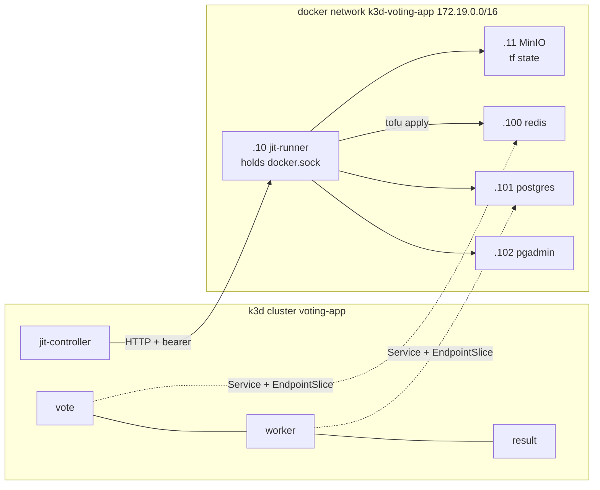
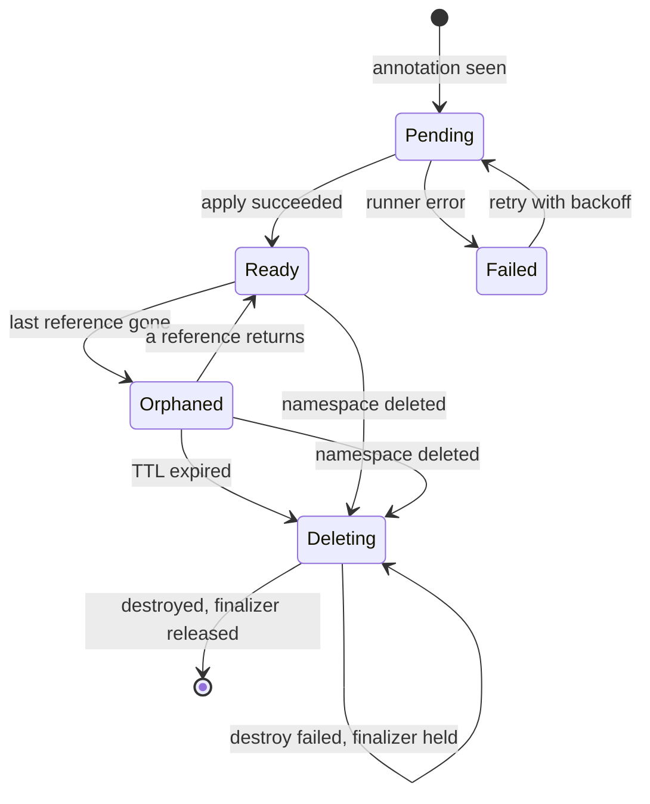

# JIT Infra PoC

**Infrastructure that appears when an app deploys and goes away when the app does.**

A tenant annotates a Deployment; a controller provisions real infrastructure outside the
cluster; deleting the app starts a retention clock; deleting the namespace tears
everything down immediately.

Proof of concept on k3d. **Not production grade** — see [Limits](#limits).

---

## Table of Contents

1. [Start here: the console](#start-here-the-console)
2. [What it does](#what-it-does)
3. [How it works](#how-it-works)
   - [Architecture at a glance](#architecture-at-a-glance)
   - [The two things worth knowing](#the-two-things-worth-knowing)
4. [What this simulates](#what-this-simulates)
5. [Prerequisites](#prerequisites)
6. [Running it](#running-it)
   - [Make targets](#make-targets)
   - [Key lifecycle checks](#key-lifecycle-checks)
   - [From cold](#from-cold)
7. [Layout](#layout)
8. [Key documents](#key-documents)
   - [Running & operating](#running--operating)
   - [Design & architecture](#design--architecture)
   - [Implementation & tracking](#implementation--tracking)
   - [Learning & evidence](#learning--evidence)
9. [Claim state machine](#claim-state-machine)
10. [Troubleshooting](#troubleshooting)
    - [pgAdmin shows no server](#pgadmin-shows-no-server)
    - [Namespace stuck in `Terminating`](#namespace-stuck-in-terminating)
    - [A step fails twice](#a-step-fails-twice)
11. [Limits](#limits)

---

## Start here: the console

The shortest path in. One command serves a page that starts the stack and then shows you
what it made; every button on it is one of the `make` targets in
[Make targets](#make-targets).

```bash
python3 console/serve.py      # python3 only, no dependencies
open http://127.0.0.1:8090
```

Open it before there is a cluster: the page says **Nothing is running yet** and polls `make state`
every two seconds. **Start the demo** then runs the whole cold path for one namespace — about three
minutes, `make demo-up` — and the log pane fills as it goes. `Ctrl-C` stops the page and leaves the
stack up; ending the stack is what **Shut the JIT plane down** is for.

| Mode | The buttons, in order |
|---|---|
| **Demo** — one namespace | **Start the demo** → **Delete the deployment** → **Redeploy inside the window** → **Delete the namespace** |
| **Testing** — both namespaces | **Set everything up** → **Start the control plane** → **Check the app works** → **Check the JIT behaviour** → **Delete `voting-b`** → **Shut the JIT plane down** → **Delete everything** |

`voting-b` exists for one check, **J8**: a hard delete takes one namespace and leaves the other alone.

| Tab | What it shows |
|---|---|
| **Setup** | The buttons. Each one is a single `make` target from [Make targets](#make-targets). |
| **Infrastructure** | Claims and their phase, the live countdown on anything Orphaned, the containers, the state objects. |
| **Voting app** | The vote and result pages for the selected namespace, as real iframes. |
| **Guide** | What every tab, mode, claim state and button does. |

The console holds no state and computes nothing. Everything it displays is read from the
same sources the frozen checks read, and every button is one entry in `serve.py`'s
`ALLOWED` dict — there is no command box. If the page ever computed a phase or an expiry
for itself, it would disagree with `make jit-verify` eventually, and that disagreement
would be the thing you debug instead of the system.

> [!TIP]
> Endpoints, the no-state rule, how to add an action, known rough edges:
> [`console/README.md`](console/README.md). The target behind each button is
> [`docs/JIT-MAKEFILE-GUIDE.md`](docs/JIT-MAKEFILE-GUIDE.md); to run the same steps by
> hand, one command at a time, see
> [`docs/JIT-MANUAL-GUIDE.md`](docs/JIT-MANUAL-GUIDE.md).

---

## What it does

```yaml
kind: Deployment
metadata:
  name: vote
  namespace: voting-a
  annotations:
    jit.infra/redis:    '{"maxmemory":"128mb"}'
    jit.infra/postgres: '{"db":"voting"}'
    jit.infra/pgadmin:  '{}'
```

`kubectl apply` and three containers appear on the Docker network. `kubectl delete ns voting-a`
and they are gone. The tenant never touches Terraform, a CRD, or a service catalogue.

## How it works

An in-cluster controller owns the **lifecycle**; an out-of-cluster runner owns the
**provisioning**. Terraform modules live in their own repo, versioned by git ref, and
never enter the cluster. The controller holds no Docker socket and no state credentials —
it makes an authenticated HTTP call and writes the results back into Kubernetes.

Infrastructure is provisioned as Docker containers on the host daemon, outside k3d, and
consumed from inside the cluster via a Service with no selector plus an EndpointSlice —
the same pattern you would use for an RDS endpoint.

### Architecture at a glance



Solid arrows are control flow, dotted are data: the controller never touches Docker and never
holds state credentials, which is the point of the split-plane design. The three containers get
static addresses from the block the IPAM ledger hands each namespace (`172.19.0.100-109`).

> [!NOTE]
> Mermaid: GitHub renders it, VS Code needs the *Markdown Preview Mermaid Support* extension.
> The full set — create, soft delete, hard delete, resync — is in
> [`docs/jit-infra-flows.md`](docs/jit-infra-flows.md).

### The two things worth knowing

**The Namespace owns the lifecycle, not the Deployment.** Prod is one namespace per app,
so namespace-owned is app-owned. Rollouts and `kubectl delete deploy` do not touch
infrastructure; a Deployment is a spec revision, not an application.

**Cleanup has two speeds.** Deleting a Deployment marks the claim `Orphaned` and starts a
TTL — redeploy inside the window and the same container comes back with its data intact.
Deleting the Namespace destroys immediately, ignoring the TTL. Accidents get a grace
period; deliberate acts do not.

## What this simulates

| Prod | Here |
|---|---|
| AWS control plane | host Docker daemon |
| EKS | k3d cluster `voting-app` |
| Versioned TF modules in a repo | `jit-modules` repo, pinned by git ref |
| TF runs in CI with cloud creds | `jit-runner` container holding the Docker socket |
| S3 state + locking | MinIO, S3 backend, per-namespace key prefix |
| ElastiCache / RDS | `redis` / `postgres` containers |

Not simulated: IAM, network policy, approval gates, provisioning latency.

---

## Prerequisites

- **k3d**, **kubectl**, **Docker**
- **OpenTofu** (arm64 build on Apple silicon)
- **python3** — for the console; standard library only, no `pip install`
- Cluster created with `--subnet 172.19.0.0/16` — the static IP allocation depends on it

The app the demo deploys is already in this repo at `app/` — nothing to clone alongside it.

[`docs/JIT-MANUAL-GUIDE.md` §2](docs/JIT-MANUAL-GUIDE.md#2-prerequisites) has the same
list as a table, with the command that checks each tool.

## Running it

Two guides, split by how much you want to see:

| Guide | Use it when |
|---|---|
| [`docs/JIT-MAKEFILE-GUIDE.md`](docs/JIT-MAKEFILE-GUIDE.md) | You want the short path: every target, its variables, the common workflows, and what a passing run exits with |
| [`docs/JIT-MANUAL-GUIDE.md`](docs/JIT-MANUAL-GUIDE.md) | You want to watch it happen: cluster creation to teardown, one `kubectl` or `docker` command at a time, each with the output that says it worked |

Both demo namespaces come from one kustomize base; only the namespace, ingress hosts, and
pgAdmin's host port differ (see `app/kustomize/overlays/voting-b/kustomization.yaml`).
To start from a machine with nothing on it, follow [From cold](#from-cold) — the sequence
`docs/evidence/s17-cold-path-green.log` records.

### Make targets

[`docs/JIT-MAKEFILE-GUIDE.md`](docs/JIT-MAKEFILE-GUIDE.md) is the reference: what every
target runs, the four variables (`DEMO_NS`, `TENANTS`, `NS`, `STEP`), worked workflows, and
the `tee` + `PIPESTATUS` idiom that keeps a target's exit code honest. `make help` lists
them all.

One name covers two buttons — `ns-delete` serves `voting-a` and `voting-b` — and two are
reads the page makes for itself rather than buttons.

| Console button | Target |
|---|---|
| Start the demo | `make demo-up` |
| Delete the deployment | `make demo-undeploy` |
| Redeploy inside the window | `make demo-redeploy` |
| Delete the namespace | `make ns-delete NS=voting-a` |
| Set everything up | `make test-up` |
| Start the control plane | `make jit-up` |
| Check the app works | `make verify NS=voting-a` |
| Check the JIT behaviour | `make jit-verify` |
| Delete `voting-b` | `make ns-delete NS=voting-b` |
| Shut the JIT plane down | `make jit-down` |
| Delete everything | `make destroy` |
| *(read, not a button)* | `make state`, `make targets` |

`make targets` prints the allowlist — anything not on that list cannot be reached from the
page. `make ns-delete` refuses an empty `NS`, and any `NS` outside `TENANTS`. `make state`
and `make targets` print payloads something else parses, so nothing else may write to their
stdout.

Outside the allowlist: `make check STEP=NN` runs one frozen checkpoint, and the app's own
loop lives in `app/Makefile` — run from `app/`, `make all` is its `deploy` then its `verify`.

> [!WARNING]
> Three of these cannot be undone: `make ns-delete`, `make jit-down`, `make destroy`.
> `make demo-undeploy` can, but only by a redeploy inside the window.

### Key lifecycle checks

| Check | What it proves |
|---|---|
| **J4** | Delete a Deployment -> infra keeps running, other workloads unaffected |
| **J5** | Redeploy inside the TTL window -> same containers, data intact |
| **J8** | Delete a namespace -> immediate teardown, other namespaces untouched |
| **J9** | Controller restart -> the orphan is still detected |

### From cold

**`make demo-up` is this sequence.** It is written out because when the cold path breaks,
these are the seven commands that tell you which one broke it.

Two passes of the app's own loop: step 2 stops by design — there is no CRD yet — and step 6 is
the pass that succeeds. Every line is load-bearing: the green run is
`docs/evidence/s17-cold-path-green.log`, and the three runs before it show each defect it fixed.
The console's **Delete everything** is the root `make destroy`, which does both teardown steps in
one command.

```bash
cd app && make destroy            # 1. the cluster goes, and with it the app
cd app && make deploy             # 2. creates the cluster; stops until the CRD exists - expected, not a failure
make jit-down                     # 3. the module containers and their volumes outlive the cluster
make jit-up                       # 4. imports the controller image, starts the stack
kubectl create ns voting-a        # 5. an overlay sets a namespace; it does not create one
cd app && make all                # 6. 17 PASS, 0 FAIL
make jit-verify                   # 7. 11 PASS, 0 FAIL
```

---

## Layout

```
.
+-- README.md                <- you are here
+-- RUNBOOK.md               <- the page to keep open while building
+-- Makefile                 <- root orchestration (jit-up, jit-down, verify, check)
|
+-- console/                 <- the console: a local page, no build step, no dependencies
|   +-- serve.py             <- the page, /state (make state), /log, POST /run/{name} (ALLOWED)
|   +-- index.html           <- the page itself
|
+-- app/                     <- the voting app: copied in, edited here
|   +-- Makefile             <- app build/deploy/verify (make all, make verify)
|   +-- kustomize/           <- base + per-tenant overlays (voting-a, voting-b)
|   +-- scripts/             <- build.sh, deploy.sh, verify.sh, cleanup.sh
|   +-- vote/                <- vote frontend
|   +-- worker/              <- background processor
|   +-- result/              <- result frontend
|
+-- jit-controller/          <- in-cluster operator (Python, kopf)
|   +-- main.py              <- claim lifecycle, IPAM, resync loop
|   +-- ipam.py              <- per-namespace IP block allocator
|   +-- test_ipam.py         <- unit tests for pure allocation logic
|
+-- jit-runner/              <- out-of-cluster provisioning service (Python, Flask)
|   +-- main.py              <- /v1/runs API, tofu init/apply/destroy
|   +-- deployment.yaml      <- Kubernetes Deployment for the runner
|
+-- jit-modules/             <- Terraform/OpenTofu modules (one per infra type)
|   +-- modules/
|       +-- redis/
|       +-- postgres/
|       +-- pgadmin/
|
+-- deploy/                  <- bootstrap: cluster, MinIO, runner, CRD
|   +-- minio.sh             <- MinIO setup (bucket, credentials)
|   +-- runner.sh            <- jit-runner container bootstrap
|   +-- controller.yaml      <- controller Deployment + RBAC
|   +-- crd/
|       +-- infraclaim.yaml  <- InfraClaim CustomResourceDefinition
|
+-- scripts/
|   +-- jit-up.sh            <- bring the whole stack up
|   +-- jit-down.sh          <- tear it down (waits for claims)
|   +-- verify-jit.sh        <- J1-J11 lifecycle test suite
|   +-- checks/              <- frozen checkpoint scripts, one per step
|
+-- docs/
    +-- jit-infra-poc.md     <- design note (v4) -- the source of truth
    +-- jit-infra-flows.md   <- Mermaid diagrams for all flows
    +-- JIT-MAKEFILE-GUIDE.md <- every make target, its variables and its workflows
    +-- JIT-MANUAL-GUIDE.md  <- the same thing by hand, one command at a time
    +-- build-plan.md        <- the implementation plan, one step at a time
    +-- todo.md              <- step tracker (check + review boxes)
    +-- lessons.md           <- corrections that became rules
    +-- 01-jit-poc.md        <- working rules for AI agent sessions
    +-- decisions/           <- Architecture Decision Records (template)
    +-- evidence/            <- verbatim run logs and probe scripts
    +-- reviews/             <- review prompts and findings, one per reviewed step
```

---

## Key documents

### Running & operating

| Document | What it covers | Read when |
|---|---|---|
| [`docs/JIT-MAKEFILE-GUIDE.md`](docs/JIT-MAKEFILE-GUIDE.md) | **Make targets** — what each one runs, its variables, common workflows, the console's allowlist, evidence and exit codes | You want the command, not the reasoning |
| [`docs/JIT-MANUAL-GUIDE.md`](docs/JIT-MANUAL-GUIDE.md) | **By hand** — fifteen sections, cluster to teardown, one `kubectl` or `docker` command at a time | Reacquainting yourself, or proving a step really happens |
| [`console/README.md`](console/README.md) | **The console** — the three endpoints, the no-state rule, how to add an action, known rough edges | Running or changing the console |

### Design & architecture

| Document | What it covers | Read when |
|---|---|---|
| [`docs/jit-infra-poc.md`](docs/jit-infra-poc.md) | **Design note (v4)** — core decisions: annotation on Deployment, ownership on Namespace, two-speed cleanup, claim lifecycle | Something feels wrong, or you need to understand *why* |
| [`docs/jit-infra-flows.md`](docs/jit-infra-flows.md) | **Mermaid diagrams** — create, soft delete, hard delete, claim state machine, resync loop, component layout | You need a visual overview of a specific flow |
| [`docs/01-jit-poc.md`](docs/01-jit-poc.md) | **Working rules** — scope, method, code conventions for agent-driven implementation | Starting a new AI coding session |
| [`docs/decisions/`](docs/decisions/) | **ADRs** — architecture decision records (template at `0000-template.md`) | A decision needs formal documentation |

### Implementation & tracking

| Document | What it covers | Read when |
|---|---|---|
| [`RUNBOOK.md`](RUNBOOK.md) | **Daily page** — the implement -> review -> resolve loop, one step at a time | Every session. Keep it open. |
| [`docs/build-plan.md`](docs/build-plan.md) | **The steps** — each with scope, checkpoints, and acceptance criteria | Checking what a step involves |
| [`docs/todo.md`](docs/todo.md) | **Tracker** — check and review boxes per step, settled decisions | Seeing where things stand |

### Learning & evidence

| Document | What it covers | Read when |
|---|---|---|
| [`docs/lessons.md`](docs/lessons.md) | **Rules from rework** — each entry is a rule with the evidence that produced it | Something looks like a pattern you've seen before |
| [`docs/evidence/`](docs/evidence/) | **Run logs and probes** — verbatim output from checkpoints and diagnostic scripts | Verifying a claim or reproducing a run |
| [`docs/reviews/`](docs/reviews/) | **Review prompts and findings** — one pair per reviewed step | Understanding what a review caught |

---

## Claim state machine

The novel logic — everything in Stage C of the build plan exists to make this correct.



Two transitions carry the design:

- **`Orphaned` -> `Ready`** is resurrection. It is why a rollout costs nothing.
- **`Orphaned` -> `Deleting`** on namespace delete bypasses the TTL. Soft and hard paths
  converge on the same destroy, at different speeds.

A destroy that fails keeps the finalizer and retries on the next resync tick, which is what holds
a namespace in `Terminating` — the escape hatch is under [Troubleshooting](#troubleshooting). The
same diagram, with more surrounding detail, is in [`docs/jit-infra-flows.md`](docs/jit-infra-flows.md) section 4.

---

## Troubleshooting

Symptom→fix tables for the common failures are in
[`docs/JIT-MAKEFILE-GUIDE.md`](docs/JIT-MAKEFILE-GUIDE.md#troubleshooting) and
[`docs/JIT-MANUAL-GUIDE.md`](docs/JIT-MANUAL-GUIDE.md#15-when-something-is-wrong). The three
below need more room than a table row.

### pgAdmin shows no server

`var.share_dir` must point at a directory visible to the Docker daemon. The runner's own
filesystem is not — Docker silently creates an empty *directory* for a bind source it
cannot see, so pgAdmin comes up with no server registered. The deploy scripts write the
servers JSON to `$HOME/.jit-host-share/`.

### Namespace stuck in `Terminating`

The finalizer is held because the runner call failed. Escape hatch:

```bash
# 1. Destroy the infra manually
export AWS_ACCESS_KEY_ID="$(grep ^MINIO_ROOT_USER= deploy/.env | cut -d= -f2-)"
export AWS_SECRET_ACCESS_KEY="$(grep ^MINIO_ROOT_PASSWORD= deploy/.env | cut -d= -f2-)"
tofu init -backend-config=bucket=jit-state \
  -backend-config=key="ns/<ns>/<module>/terraform.tfstate" \
  -backend-config=endpoint=http://127.0.0.1:9000 -backend-config=region=us-east-1 \
  -backend-config=access_key="$AWS_ACCESS_KEY_ID" -backend-config=secret_key="$AWS_SECRET_ACCESS_KEY" \
  -backend-config=skip_credentials_validation=true -backend-config=skip_metadata_api_check=true \
  -backend-config=force_path_style=true
tofu destroy -auto-approve -var name=<ns>-<module> -var network=k3d-voting-app -var ip=<ip>
#    redis needs nothing more. postgres also needs -var postgres_password=<secret>,
#    and pgadmin needs that *and* -var postgres_url=<address>:<port>.

# 2. Patch the finalizer off
kubectl patch infraclaim <ns>-<module> -n <ns> --type=json \
  -p='[{"op":"replace","path":"/metadata/finalizers","value":[]}]'

# 3. Clean up the IPAM ledger
kubectl get configmap jit-ipam -n default -o json \
  | jq --arg ns '<ns>' '.data.allocations |= (fromjson | del(.[$ns]) | tojson)' \
  | kubectl replace -f -

# 4. Or tear down the whole stack
make jit-down
```

### A step fails twice

Stop. That is usually a design problem wearing an implementation costume — go back to the
design note ([`docs/jit-infra-poc.md`](docs/jit-infra-poc.md)) rather than deeper into
the code.

---

## Limits

This is a proof of concept. Things it deliberately does not address:

| Limit | What production would add |
|---|---|
| **No IAM or RBAC** — the runner has unrestricted Docker access | Scoped credentials, and a runner that does not need the socket |
| **No console auth or TLS** — it binds `127.0.0.1` and runs an allowlist | Authentication in front of that same allowlist |
| **No network policy** — every container shares one Docker bridge | Per-tenant network isolation |
| **No approval gates** — anything annotated is provisioned immediately | A policy step between the annotation and the apply |
| **No provisioning latency modelling** — containers start in seconds | Async provisioning with a declared, honest wait |
| **No multi-node scheduling** — one Docker host | A real scheduler and placement rules |
| **No horizontal scaling** — one controller, one runner, one MinIO | An HA controller and runner |
| **No Terraform locking** — MinIO is an S3 backend with no lock table | A lock, so two applies cannot race over one workspace |
| **No snapshot or backup** — soft delete covers the accident case | Snapshot before destroy, and `retain: true` |
| **No monitoring or alerting** — logs go to stdout | Metrics on claim phases, and alerts when one sticks |
| **No secret rotation** — passwords live until the infra is destroyed | Rotation, and an answer for the pods already holding the Secret |

*(The right-hand column is this README's summary of what the PoC leaves open, not a schedule — the design note has the detail.)*

For production, start with the [design note](docs/jit-infra-poc.md) and work forward.
