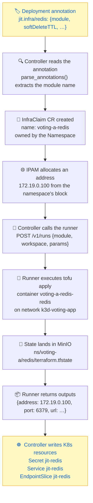

# Annotation to State: The Full Mapping

This document traces the complete path from a tenant's Deployment annotation to the
Terraform state in MinIO. When something goes wrong, this is the chain to walk.

## The chain, in one diagram



The readiness gate is the Secret: a pod that depends on `jit-redis` sits in
`CreateContainerConfigError` until the final step writes it.

## Step by step with a concrete example

Starting point: a tenant applies this to namespace `voting-a`:

```yaml
# app/kustomize/base/vote-deployment.yaml
metadata:
  name: voting-app-vote
  annotations:
    jit.infra/redis: '{"module":"redis","moduleVersion":"v1","params":{},"softDeleteTTL":"10m"}'
    jit.infra/postgres: '{"module":"postgres","moduleVersion":"v1","params":{},"softDeleteTTL":"10m"}'
    jit.infra/pgadmin: '{"module":"pgadmin","moduleVersion":"v1","params":{},"softDeleteTTL":"10m"}'
```

### 1. Controller reads the annotation

`jit-controller/main.py` → `parse_annotations()` scans for keys starting with
`jit.infra/`. The suffix after the slash becomes the **module name**:

| Annotation key | Module | Claim name |
|---|---|---|
| `jit.infra/redis` | `redis` | `voting-a-redis` |
| `jit.infra/postgres` | `postgres` | `voting-a-postgres` |
| `jit.infra/pgadmin` | `pgadmin` | `voting-a-pgadmin` |

The claim name is always `{namespace}-{module}`.

### 2. Controller creates the InfraClaim

```yaml
apiVersion: jit.io/v1alpha1
kind: InfraClaim
metadata:
  name: voting-a-redis           # {namespace}-{module}
  namespace: voting-a
  ownerReferences:
    - kind: Namespace            # Owned by the Namespace, not the Deployment
      name: voting-a
  finalizers:
    - jit.infra/teardown         # Blocks deletion until destroy succeeds
spec:
  module: redis
  moduleVersion: v1
  params: {}
  softDeleteTTL: 10m
status:
  phase: Ready
  allocatedIP: 172.19.0.100     # From IPAM
  referencedBy: [voting-app-vote, voting-app-worker]
  expiresAt: null                # Set when Orphaned
```

### 3. IPAM allocates an address

`jit-controller/ipam.py` assigns a block of 10 IPs from `172.19.0.100-199` per
namespace. Each claim gets its own address within the block:

| Namespace | Block | Claim | IP |
|---|---|---|---|
| voting-a | 172.19.0.100-109 | voting-a-redis | 172.19.0.100 |
| voting-a | 172.19.0.100-109 | voting-a-postgres | 172.19.0.101 |
| voting-a | 172.19.0.100-109 | voting-a-pgadmin | 172.19.0.102 |
| voting-b | 172.19.0.110-119 | voting-b-redis | 172.19.0.110 |
| voting-b | 172.19.0.110-119 | voting-b-postgres | 172.19.0.111 |
| voting-b | 172.19.0.110-119 | voting-b-pgadmin | 172.19.0.112 |

Block allocation is stored in the `jit-ipam` ConfigMap in `default` namespace.

### 4. Controller calls the runner

```
POST /v1/runs
{
  "module": "redis",
  "workspace": "voting-a",
  "params": {
    "name": "voting-a-redis",
    "ip": "172.19.0.100",
    "network": "k3d-voting-app"
  }
}
```

The controller adds `name`, `ip`, and `network` to whatever the annotation's `params`
contained. For postgres, it also adds `postgres_password`. For pgadmin, it adds
`postgres_url` and `postgres_password` (resolved from the `jit-postgres` Secret).

### 5. Runner executes tofu

The runner (`jit-runner/main.py`):

1. Copies the module from `jit-modules/modules/{module}/` to a temp directory
2. Runs `tofu init` with backend config pointing to MinIO
3. Runs `tofu apply -auto-approve` with the params as `-var` flags

### 6. State lands in MinIO

The state key is **`ns/{workspace}/{module}/terraform.tfstate`**:

| InfraClaim | Workspace | Module | MinIO key |
|---|---|---|---|
| voting-a-redis | voting-a | redis | `ns/voting-a/redis/terraform.tfstate` |
| voting-a-postgres | voting-a | postgres | `ns/voting-a/postgres/terraform.tfstate` |
| voting-a-pgadmin | voting-a | pgadmin | `ns/voting-a/pgadmin/terraform.tfstate` |
| voting-b-redis | voting-b | redis | `ns/voting-b/redis/terraform.tfstate` |

All state files live in the `jit-state` bucket.

### 7. Runner returns outputs

The module's Terraform outputs come back to the controller:

| Module | Outputs | Written to |
|---|---|---|
| redis | `address`, `port`, `url` | `Secret jit-redis` |
| postgres | `address`, `port`, `url`, `volume_name` | `Secret jit-postgres` (+ generated `POSTGRES_PASSWORD`) |
| pgadmin | `address`, `port`, `http_port`, `url`, `postgres_url` | `Secret jit-pgadmin` |

### 8. Controller writes Kubernetes resources

For each claim, the controller writes:

- **Secret** `jit-{module}` — the module's outputs (address, port, password, etc.)
- **Service** `jit-{module}` — ClusterIP service pointing at the container's IP
- **EndpointSlice** `jit-{module}` — routes the Service to the container's static IP

The app reads these — it never touches Docker, MinIO, or the runner.

## How to look things up

### "Where is the Terraform state for voting-a's Redis?"

```bash
# From MinIO (via make state)
make -s state | python3 -c "
import json, sys
d = json.load(sys.stdin)
for s in d.get('stateObjects', []):
    if 'voting-a' in s and 'redis' in s:
        print(s)
"
# → ns/voting-a/redis/terraform.tfstate
```

### "What IP does voting-a-postgres have?"

```bash
kubectl get infraclaim voting-a-postgres -n voting-a -o jsonpath='{.status.allocatedIP}'
# → 172.19.0.101
```

### "Which Deployments reference the redis claim?"

```bash
kubectl get infraclaim voting-a-redis -n voting-a -o jsonpath='{.status.referencedBy}'
# → ["voting-app-vote","voting-app-worker"]
```

### "What container does the claim map to?"

Container name is `{workspace}-{module}-{module}`:

| Claim | Container |
|---|---|
| voting-a-redis | voting-a-redis-redis |
| voting-a-postgres | voting-a-postgres-postgres |
| voting-a-pgadmin | voting-a-pgadmin-pgadmin |

```bash
docker ps --filter name=voting-a-redis-redis
```

### "Show me the full picture for one namespace"

```bash
# Everything the console sees
make -s state | python3 -m json.tool

# Or from kubectl
kubectl get infraclaims -n voting-a -o wide
kubectl get secrets -n voting-a | grep jit
kubectl get services -n voting-a | grep jit
```

## The naming convention

Everything follows the same pattern: **`{namespace}-{module}`**

| Layer | Name | Example |
|---|---|---|
| Annotation key | `jit.infra/{module}` | `jit.infra/redis` |
| InfraClaim | `{namespace}-{module}` | `voting-a-redis` |
| Container | `{namespace}-{module}-{module}` | `voting-a-redis-redis` |
| Secret | `jit-{module}` (per namespace) | `jit-redis` in voting-a |
| Service | `jit-{module}` (per namespace) | `jit-redis` in voting-a |
| MinIO key | `ns/{namespace}/{module}/terraform.tfstate` | `ns/voting-a/redis/terraform.tfstate` |
| IPAM block | Per namespace, 10 IPs | voting-a: `172.19.0.100-109` |

The container name looks odd (`redis-redis`) because the module's Terraform appends
`-redis` to the `name` variable, and the controller sets `name` to `{namespace}-{module}`.
This is a PoC convention, not a design rule.