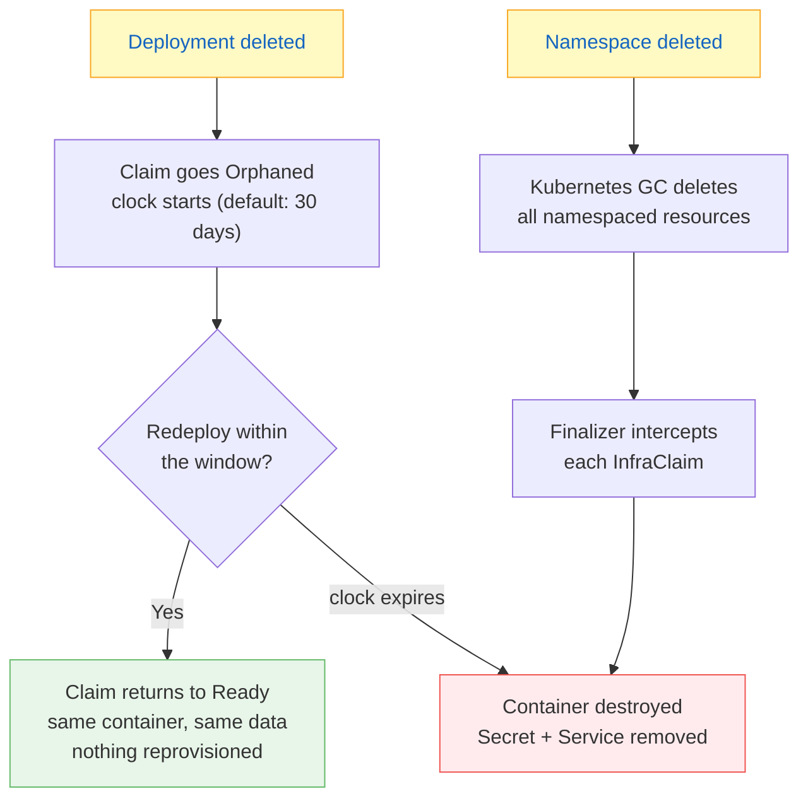

# What Happens When You Delete the App

## Table of Contents

1. [The short version](#the-short-version)
2. [The two speeds](#the-two-speeds)
3. [How the controller knows](#how-the-controller-knows)
4. [The finalizer](#the-finalizer)
   - [Where it is added](#where-it-is-added)
   - [What it does](#what-it-does)
   - [The two paths that remove it](#the-two-paths-that-remove-it)
   - [The double-release guard](#the-double-release-guard)
   - [What happens when the runner is down](#what-happens-when-the-runner-is-down)
5. [Soft delete — deleting the Deployment](#soft-delete--deleting-the-deployment)
   - [What triggers it](#what-triggers-it)
   - [What happens, step by step](#what-happens-step-by-step)
   - [What stays alive during the window](#what-stays-alive-during-the-window)
   - [What redeploy does (resurrection)](#what-redeploy-does-resurrection)
   - [What the TTL sweep does (expiry)](#what-the-ttl-sweep-does-expiry)
6. [Hard delete — deleting the Namespace](#hard-delete--deleting-the-namespace)
   - [What triggers it](#what-triggers-it-1)
   - [What happens, step by step](#what-happens-step-by-step-1)
   - [What's left after](#whats-left-after)
   - [What happens to the other namespace](#what-happens-to-the-other-namespace)
   - [If the runner is down](#if-the-runner-is-down)
7. [See it in action](#see-it-in-action)

---

## The short version

Delete the app. A clock starts. The container keeps running.

Redeploy inside the window and the clock is cleared — the database never went anywhere.
The same container, the same data, the same IP. A rollout costs nothing.

Let the clock run out and the container is destroyed, data and all.

Delete the whole namespace and it is destroyed immediately, clock or no clock.

> *Accidents get a grace period. Decisions do not.*

## The two speeds



---

## How the controller knows

The controller does not watch for delete events or sleep until expiry. It runs a
**30-second polling loop** per InfraClaim, using kopf's built-in timer:

```python
# jit-controller/main.py
@kopf.timer("jit.io", "v1alpha1", "infraclaims", interval=30, initial_delay=True)
def resync_referenced_by(body, namespace, name, logger, **kwargs):
    """Periodic resync: recompute referencedBy, handle orphaning and TTL sweep."""
```

Every 30 seconds, for every InfraClaim in the cluster, this function:

1. **Lists live Deployments** that reference this claim's module
2. **Fresh-reads the claim status** from the API server (the kopf body can lag behind
   patches the controller itself made)
3. **Decides what to do** based on whether references exist and what phase the claim is in:

| References exist? | Current phase | What the timer does |
|---|---|---|
| Yes | Not Ready, not Failed | Try provisioning (call the runner) |
| Yes | Ready | Update `referencedBy`, clear `expiresAt` |
| Yes | Failed | Log and skip — Failed is terminal until the Deployment changes |
| No | Not Orphaned | Mark `Orphaned`, set `expiresAt = now + TTL` |
| No | Orphaned | Compare `datetime.now()` against `expiresAt`; if expired → sweep |
| No | Deleting | Retry the destroy (previous attempt failed) |

The TTL check is pure datetime comparison — `now > expiresAt` — on each tick. There
is no scheduled callback, no sleep, no watch event for expiry. The30-second granularity
is fine for a PoC where the shortest TTL used in testing is 2 minutes. The default TTL
is 30 days.

> [!NOTE]
> The clock starts *late*, not early: `expiresAt` is set when the resync first notices
> the Deployment is gone, not when Kubernetes deletes it. If the controller is down when
> the Deployment is deleted, the clock starts when the controller restarts and runs its
> first resync. This is the safe direction to be wrong in — the infra lives longer, not
> shorter, than expected.

---

## The finalizer

Every InfraClaim has a finalizer: `jit.infra/teardown`. This is the mechanism that
makes the controller's cleanup reliable — Kubernetes will not delete the claim until
the finalizer is removed, and the controller only removes it after a successful
destroy.

### Where it is added

When the controller creates an InfraClaim (`ensure_claim`), the finalizer is set in
the metadata:

```yaml
metadata:
  name: voting-a-redis
  finalizers:
    - jit.infra/teardown
```

### What it does

A finalizer blocks Kubernetes from deleting an object. When something requests a
delete (a user, a namespace GC, a TTL sweep), Kubernetes marks the object for
deletion but does not remove it. It calls the controller's delete handler instead.
The handler does its work, then removes the finalizer. Only then does Kubernetes
actually delete the object.

This means the controller always gets a chance to clean up — even if it was down
when the delete was requested. The object sits in `Terminating` until the controller
comes back and handles it.

### The two paths that remove it

```
                        ┌─────────────────────────────┐
                        │       InfraClaim exists      │
                        │   finalizer: jit.infra/...   │
                        └──────────────┬──────────────┘
                                       │
                      ┌────────────────┴────────────────┐
                      │                                  │
              TTL expires                          Namespace deleted
              (timer handler)                      (delete handler)
                      │                                  │
                      ▼                                  ▼
              destroy_infra()                     destroy_infra()
              cleanup_k8s_resources()            cleanup_k8s_resources()
              remove_finalizer_and_delete()      patch: remove finalizer
              release_block()                    release_block()
                      │                                  │
                      ▼                                  ▼
              Kubernetes deletes                 Kubernetes deletes
              the InfraClaim                     the InfraClaim
```

**Path 1: TTL sweep** (the timer). The `resync_referenced_by` timer detects expiry,
calls `destroy_infra` → `cleanup_k8s_resources` → `remove_finalizer_and_delete` →
`release_block`. The `remove_finalizer_and_delete` function patches the finalizer off
and then deletes the claim in one operation.

**Path 2: Hard delete** (namespace deletion). Kubernetes GC marks the claim for
deletion. kopf's `@kopf.on.delete` handler (`handle_claim_delete`) fires, calls
`destroy_infra` → `cleanup_k8s_resources`, patches the finalizer off, then calls
`release_block`.

### The double-release guard

Both paths release the IP block. If the TTL sweep runs first (destroy succeeds,
finalizer removed, claim deleted), and then the namespace is deleted, the delete
handler fires again on the already-deleted claim. The handler checks the claim's
`phase` — if it is `Deleting`, the TTL sweep already handled it, so it skips
`release_block`:

```python
phase = (body.get("status", {}) or {}).get("phase", "")
if phase == "Deleting":
    logger.info(f"Claim {name} was already swept; not releasing its IP block twice")
else:
    release_block(namespace)
```

Without this guard, two namespaces would end up with the same IP block and containers
would fail with "Address already in use". This was a real bug found by J1.

### What happens when the runner is down

The finalizer stays. The claim stays in `Terminating`. The namespace stays in
`Terminating`. Kubernetes will not delete either until the finalizer is removed.

The controller retries on every resync tick (every 30 seconds). If the runner comes
back, the next retry succeeds and the finalizer is removed.

If the runner never comes back, the only escape is manual:

```bash
# 1. Destroy the infra by hand
tofu destroy -auto-approve ...

# 2. Patch the finalizer off
kubectl patch infraclaim voting-a-redis -n voting-a --type=json \
  -p='[{"op":"replace","path":"/metadata/finalizers","value":[]}]'

# 3. Clean up the IPAM ledger
kubectl get configmap jit-ipam -n default -o json \
  | jq --arg ns 'voting-a' '.data.allocations |= (fromjson | del(.[$ns]) | tojson)' \
  | kubectl replace -f -
```

See [the README's escape hatch](../README.md#namespace-stuck-in-terminating) for the
full procedure.

---

## Soft delete — deleting the Deployment

### What triggers it

```bash
kubectl delete deployment voting-app-vote -n voting-a
# or: make demo-undeploy
```

This is routine. Kubernetes does it on every rollout, every `kubectl set image`,
every scaling event. The JIT infra does not destroy the database because of it.

### What happens, step by step

1. **Kubernetes deletes the Deployment.** The pods are terminated. But the InfraClaim
   is not owned by the Deployment — it is owned by the Namespace — so the claim
   survives.

2. **Controller detects the Deployment is gone.** On the next resync tick (≤30s), the
   controller computes `referencedBy` from live Deployments. A claim with no references
   left is orphaned; one that still has a reference keeps its lease and arms no clock —
   after `make demo-undeploy` deletes only `vote`, `redis` and `postgres` stay `Ready`
   because `worker` (and `result`) still name them, and only `pgadmin` orphans.

3. **Controller marks the claim `Orphaned`.** Sets `expiresAt = now + TTL`. The TTL
   comes from the annotation:

   ```yaml
   annotations:
     jit.infra/redis: '{"module":"redis","softDeleteTTL":"30d"}'
   ```

   Default is 30 days. The app's base annotations ship `10m`, so the demo countdown is ten
   minutes; `make jit-verify` rewrites it to 2 minutes so J6 does not wait out the full window.

4. **Everything else stays alive.** The container, the IP, the Secret, the Service,
   the EndpointSlice — all untouched. The claim's `phase` and `expiresAt` are the
   only things that changed.

### What stays alive during the window

| Thing | Status |
|---|---|
| Docker container | Running — same process, same data |
| IP address | Reserved — no other claim can take it |
| Secret (`jit-redis`, etc.) | Present — pods can still read it |
| Service (`jit-redis`, etc.) | Present — traffic still routes |
| EndpointSlice | Present — Service → container IP still works |
| App pods (if still running) | Keep talking to the infra |

### What redeploy does (resurrection)

```bash
kubectl apply -k app/kustomize/overlays/voting-a
# or: make demo-redeploy
```

1. Controller sees a new Deployment with the same annotation in the same namespace.
2. Controller finds the existing claim — it already has an allocated IP and a running
   container.
3. Claim returns to `Ready`. `expiresAt` is cleared. The clock stops.

No `tofu apply`. No new container. No data loss.

### What the TTL sweep does (expiry)

When `expiresAt` passes, the controller's sweep runs:

1. Calls the runner: `DELETE /v1/runs/{namespace}` with the module name
2. Runner executes `tofu destroy -auto-approve` — container removed, volume removed
3. Controller removes the Secret, Service, and EndpointSlice
4. Controller releases the IP address back to the IPAM pool
5. Controller removes the finalizer and deletes the InfraClaim

After the sweep, the namespace is clean — as if the infra was never there.

If the runner is down at expiry, the destroy fails, the finalizer stays, and the
controller retries on the next resync tick.

---

## Hard delete — deleting the Namespace

### What triggers it

```bash
kubectl delete namespace voting-a
# or: make ns-delete NS=voting-a
```

This is deliberate. Someone went out of their way to remove an entire environment.
There is nothing accidental about it, and nothing to protect.

### What happens, step by step

1. **Kubernetes marks the Namespace for deletion.** It enters `Terminating`.

2. **Kubernetes GC deletes all namespaced resources.** Deployments, Services, Secrets,
   InfraClaims — everything in the namespace is marked for deletion. The claims have a
   finalizer (`jit.infra/teardown`), so their deletion is blocked.

3. **Finalizer intercepts each InfraClaim.** The controller's delete handler fires. It
   does **not** check `expiresAt` — the namespace is being destroyed, and the clock is
   irrelevant.

4. **Controller calls the runner for each module.**

   ```
   DELETE /v1/runs/voting-a
   {"module": "redis", "params": {"name": "voting-a-redis", ...}}
   ```

   The runner executes `tofu destroy -auto-approve`. The container and its volume are
   removed.

5. **Controller cleans up Kubernetes resources.** Removes the Secret, Service, and
   EndpointSlice for each module (if they haven't already been GC'd).

6. **Controller releases the IP address.** Each claim's address goes back to the IPAM
   pool. When the last claim in a namespace is released, the entire IP block is freed.

7. **Controller removes the finalizer.** The InfraClaim is deleted by Kubernetes.

8. **Namespace deletion completes.** Once all resources have their finalizers removed,
   Kubernetes removes the namespace.

### What's left after

Nothing. The namespace is gone. The containers are gone. The IP block is free. The
MinIO state objects remain (they are outside the cluster) but `make jit-down` will
clean them.

### What happens to the other namespace

Nothing. `voting-b` is completely unaffected. Its claims stay `Ready`, its containers
keep running, its IP block stays allocated. J8 in the verification suite proves this.

### If the runner is down

The finalizer cannot complete. The namespace stays `Terminating`. The controller
retries on each resync tick. See
[the escape hatch](../README.md#namespace-stuck-in-terminating) — manual `tofu
destroy`, then patch the finalizer off.

---

## See it in action

```bash
make demo-up                # bring everything up

# from the console (python3 console/serve.py):
#   1. Start the demo            — infra provisioned, app running
#   2. Delete the deployment     — soft delete: claim goes Orphaned
#   3. Redeploy inside the window — resurrection: claim back to Ready
#   4. Delete the namespace      — hard delete: everything gone
```

Or watch the claim status change:

```bash
# In one terminal
watch -n2 'kubectl get infraclaims -A -o wide'

# In another — soft delete path
make demo-undeploy          # watch phase go Orphaned, containers still running
make demo-redeploy          # watch phase go back to Ready, same containers

# Or — hard delete path
make ns-delete NS=voting-a  # watch everything disappear
```