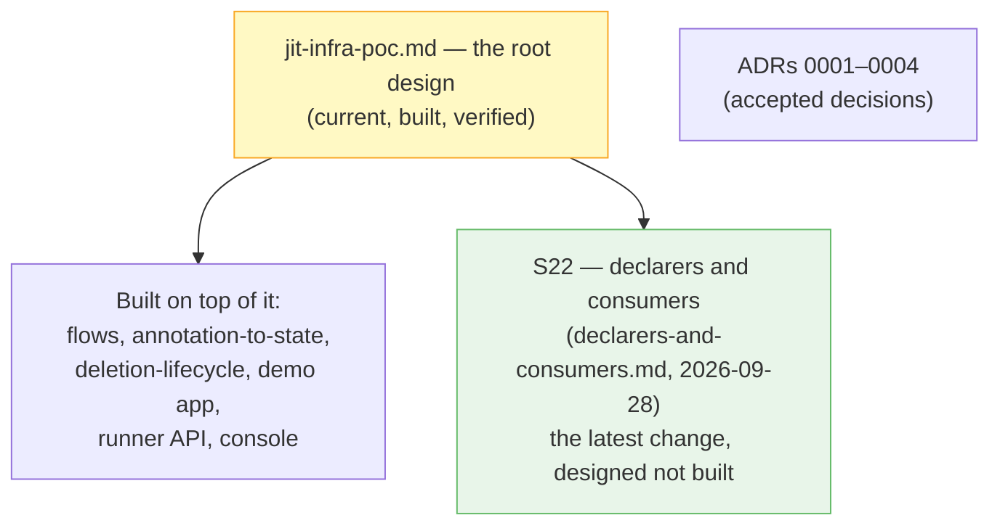

# Design Docs — Hierarchy and Reading Order

This folder holds the design record of the JIT infra PoC, with the current state at its
root. Everything hangs off one document — [jit-infra-poc.md](./jit-infra-poc.md) — plus
one open extension, [declarers-and-consumers.md](./declarers-and-consumers.md). Everything
else either diagrams the root design, explains it, or verifies it.

## The hierarchy: root, what we built on it, what we are building now

| Layer | Document | Status | The idea, in one line |
|---|---|---|---|
| **Root design** | [jit-infra-poc.md](./jit-infra-poc.md) | **Built and verified** | Annotation on the Deployment (tenant-writable), claim owned by the Namespace (survives rollouts), two-speed cleanup: soft (Orphaned + TTL) and hard (namespace delete). |
| **Built around it** | Explainers, reference and process docs below | Current | No decisions of their own; they diagram, explain or verify the root design. |
| **Latest change** | [declarers-and-consumers.md](./declarers-and-consumers.md) | **Designed, not built** | Of the Deployments sharing a claim, those with a `params` key *declare* the infra; the rest only consume it. Replaces "re-apply is a no-op" with a per-module mutability contract. |

## What each document is

### The root design (start here)

| Document | Role |
|---|---|
| [jit-infra-poc.md](./jit-infra-poc.md) | The design. Decision, cleanup model, shape, components, failure modes, verification. Its open questions feed later documents. |

### Built on top of the root design

**Extensions that amend it:**

| Document | Extends | Amends | Adds |
|---|---|---|---|
| [declarers-and-consumers.md](./declarers-and-consumers.md) | jit-infra-poc.md | annotation-to-state.md (params become declarer-only), jit-infra-flows.md (update flow) | The declarer/consumer split, resolution rules, mutability contract, update flow, S22 verification |

**Explainers and flows (no decisions of their own):**

| Document | Covers |
|---|---|
| [jit-infra-flows.md](./jit-infra-flows.md) | Sequence and state diagrams for the root design: create, soft delete, hard delete, claim state machine, resync loop. |
| [annotation-to-state.md](./annotation-to-state.md) | The full chain from one annotation to Terraform state in MinIO, step by step. The debugging map. |
| [deletion-lifecycle.md](./deletion-lifecycle.md) | The delete story in full: finalizer mechanics, both speeds, step by step. |
| [demo-voting-app.md](./demo-voting-app.md) | The tenant workload: what the voting app is and how it was moved onto JIT-provisioned infra. |

**Reference and process:**

| Document | Covers |
|---|---|
| [runner-api.md](./runner-api.md) | The jit-runner HTTP API (endpoints, auth, request/response shapes). |
| [testing-strategy.md](./testing-strategy.md) | The two verification suites: R1–R17 (app) and J1–J11 (JIT lifecycle). |
| [console-demo-test-plan.md](./console-demo-test-plan.md) | The manual, in-browser rehearsal of the console demo (tracks A–E). |

**Decisions (elsewhere in `docs/`):**

The ADRs record the choices the root design stands on (annotation surface and two-speed
cleanup, runner as a separate HTTP service, per-namespace IP blocks, console as derived
state): see `docs/decisions/`. ADRs hold the *why*; the design notes hold the *what*.

## Where we are now (2026-09-28)

- The root design is implemented and verified (J1–J11 green; see `docs/evidence/`).
- S22 (declarers and consumers) is **designed, not built**. Next concrete step is its
  half-day spike (does `call_runner` block the kopf event loop; how much a container
  replace costs), then build order steps 2–7 in
  [declarers-and-consumers.md §Build order](./declarers-and-consumers.md#build-order-and-effort).
- [declarers-and-consumers.md](./declarers-and-consumers.md) answers the root design's
  first open question (annotation edits); the root design still carries four open
  questions (orphan visibility, IP reuse, scale-to-zero, prod version gaps).
- The upstream brainstorm transcripts that fed S22 are in `docs/design/`
  (glm, grok, kimi, meta, qwen, spark).

## Working rules for this folder

1. **Every extending document says so in its header** — `Extends:`, `Amends:` — so the
   hierarchy reads from the file itself, and this README tracks that header rather than
   the other way round.
2. **Amended documents get updated in the same step.** `jit-infra-flows.md` states this
   itself: a diagram behind the code is worse than none.
3. **The root design is `[jit-infra-poc.md](./jit-infra-poc.md)`.** A document that
   replaces it in future becomes the new root and takes its place in this README; the
   old file moves out — the record to keep here is the hierarchy, not history.
