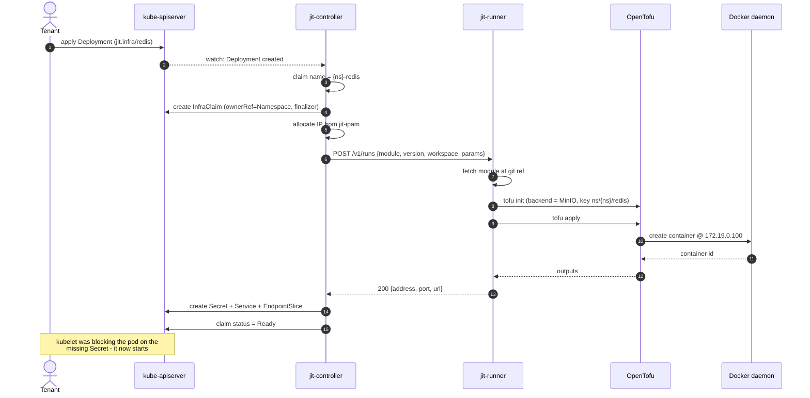
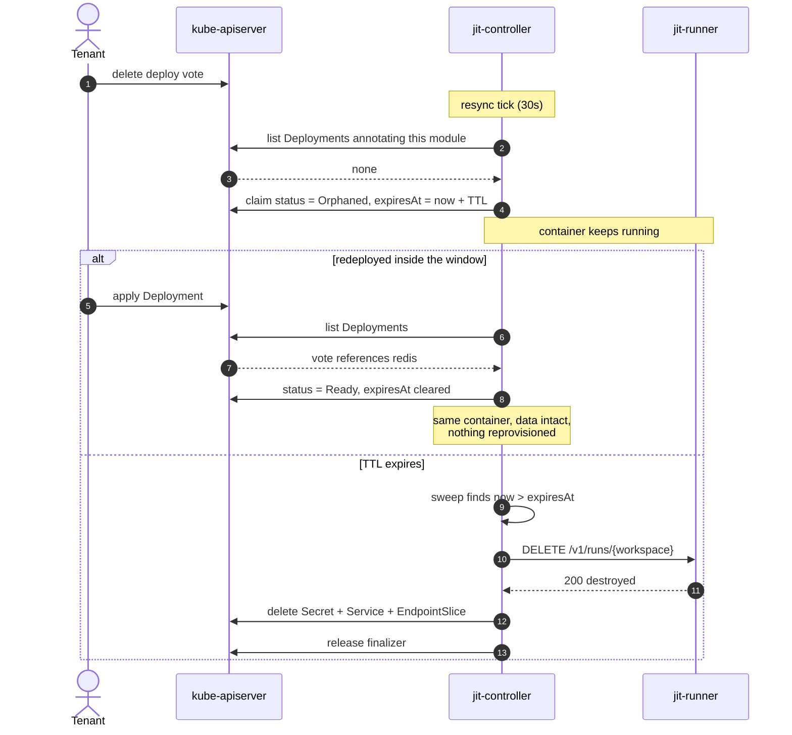
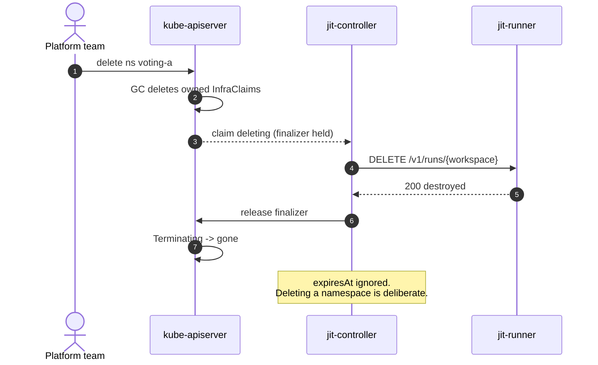
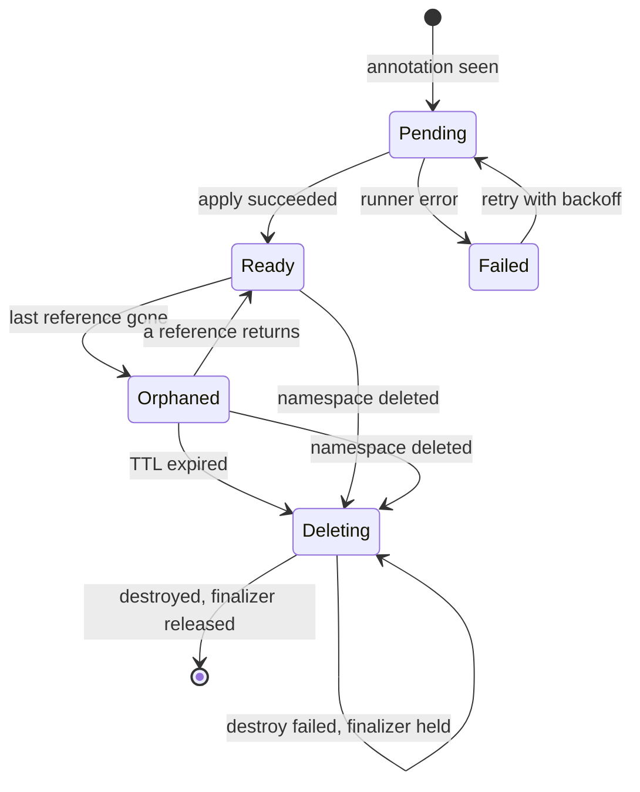
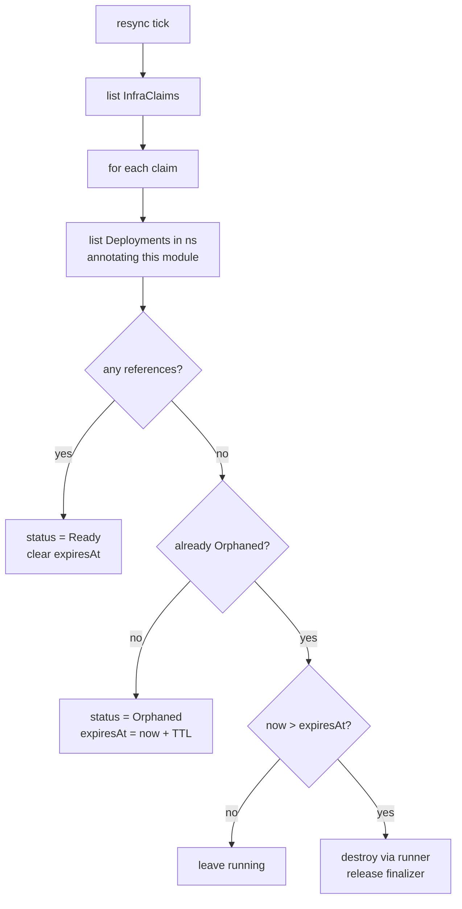
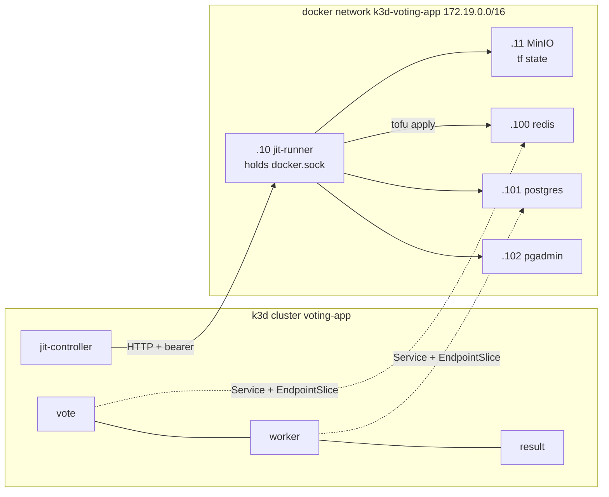

# JIT Infra - Flows

Diagrams for [jit-infra-poc.md](./jit-infra-poc.md). Mermaid, so they render in GitHub
and diff as text.

VS Code needs the *Markdown Preview Mermaid Support* extension; the built-in preview
does not render Mermaid.

**Keep these current.** The claim state machine is the novel logic in this design - if
it changes and the diagram does not, the diagram becomes actively misleading. Update it
in the same step that changes the behaviour.

---

## 1. Create - annotation to running infra

The readiness gate is the absence of the Secret, not an explicit wait. A pod sits in
`CreateContainerConfigError` until the last step.

---

## 2. Soft delete - Deployment removed

---

## 3. Hard delete - Namespace removed

If the runner call fails, the finalizer is **not** released and the namespace stays in
`Terminating`. Escape hatch: `tofu destroy` by hand, then patch the finalizer off.

---

## 4. Claim state machine

The novel logic. Everything in Stage C of the build plan exists to make this correct.

Two transitions carry the design:

- `Orphaned --> Ready` is resurrection. It is why a rollout costs nothing.
- `Orphaned --> Deleting` on **namespace deleted** bypasses the TTL. Soft and hard paths
  converge on the same destroy, at different speeds.

---

## 5. Resync loop

Why a loop and not just a delete watch: events are missed when the controller restarts.
The watch makes the common case fast; the resync makes it correct.

`referencedBy` is recomputed on every pass rather than maintained incrementally, which
is what makes refcounting work without a counter: two Deployments asking for Redis
produce one claim, and it only orphans when the last one goes.

---

## 6. Components

Solid arrows are control flow, dotted are data. The controller never touches Docker and
never holds state credentials - that separation is the point of the split-plane shape.
