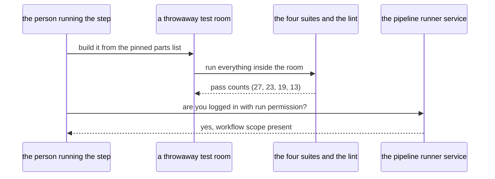

# CI01 - The fast half is green locally, and the runner can be dispatched

## In one sentence

The four small test suites and the helper lint pass on this machine from a clean install, and the command-line tool that will run the pipeline is logged in with permission to do so — so later steps have a known-good baseline to reproduce on a stock runner.

## How it works

## What changes

- **A throwaway test room** - built outside the repo from the pinned parts list plus the test runner, so the repo's own setup stays untouched.
- **The pass counts on record** - twenty-seven for the address logic, twenty-three for the declarers, nineteen plus thirteen for the console, all green, becoming the numbers the fast job asserts.
- **The missing piece named** - the repo's own setup lacks one library the declarer suite needs, which is why the room is built from the parts list instead of reusing it.
- **The dispatch permission confirmed** - the runner tool is logged in with the scope that lets it start pipeline runs.

## Choices you might want different

- The room is rebuilt from the parts list on every check rather than reusing the repo's setup, trading a minute of install time for a result that means the same thing on any machine.
