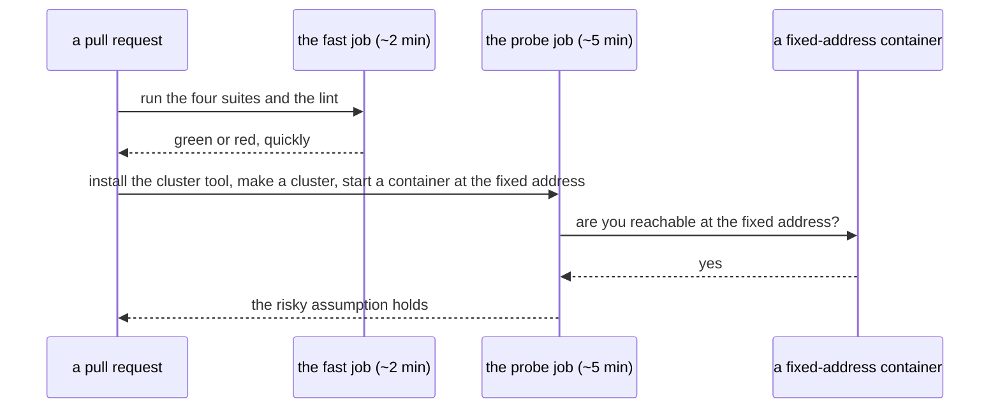

# CI02 - A stock runner can host the cluster's fixed network

## In one sentence

The pipeline file exists with its two jobs, and a run on an ordinary hosted machine proves the fast checks pass there and the cluster's fixed network addresses work there too.

## How it works

## What changes

- **One pipeline file** - two jobs that run side by side on a pinned machine type, started by a push, a pull request, or a manual button.
- **The fast job** - the same four suites and lint from the baseline, with the setup the hosted machine lacks installed and one missing-file guard fixed that the first red run found, so the hosted result means the same as the local one.
- **The probe job** - a small experiment, not the real workload yet: it installs the pinned cluster tool, creates a cluster on the fixed subnet, and reaches a container at the fixed address the runner will later use.
- **The run happens before the merge** - the pull request trigger is how the file proves itself while still off the main branch.

## Choices you might want different

- The cluster tool version is pinned rather than floating, trading automatic updates for runs that mean the same thing from one week to the next.
- The probe uses a throwaway container instead of the real runner, keeping this step about the network question only; the real cold path arrives in a later step.
