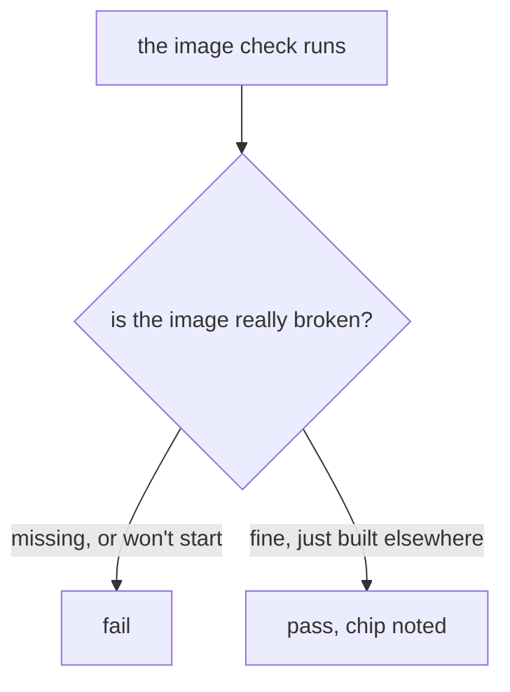

# CI03 - The repo builds and the checks pass on either chip

## In one sentence

The three places that assumed the maintainer's machine now build and judge for whatever machine they run on, with no change in what passes on the maintainer's machine.

## How it works

## What changes

- **The runner image recipe** - fetches the infrastructure tool for its own chip instead of always the maintainer's, so the same recipe builds on either.
- **The app image script** - stops requesting one chip on both its paths, so the builder builds native wherever it runs.
- **The image check** - still reads the chip and prints it, but fails only on images that are actually broken: missing references or containers that cannot start.
- **Nothing on the maintainer's machine changes** - a native build there still produces the same chip, and the same suites still pass.

## Choices you might want different

- The chip is still reported in the check's pass line rather than dropped, so a mixed fleet stays visible instead of silent.
- The download picks the chip at build time rather than pinning one per machine, trading a slightly cleverer line for a single recipe with no branches.
