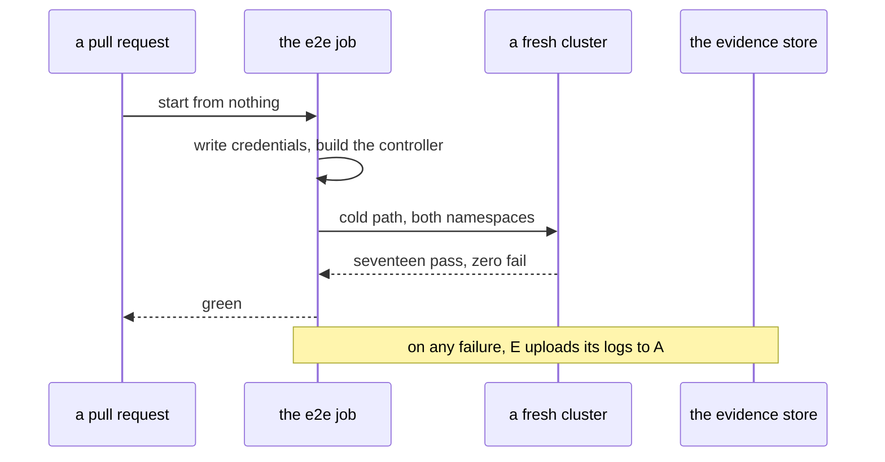

# CI04 - The e2e job runs the cold path

## In one sentence

The probe job grows into the real thing: on a fresh hosted machine it writes the throwaway credentials, builds the controller, runs the full cold path to seventeen green checks, and saves the evidence when anything fails.

## How it works

## What changes

- **The credentials first** - the job writes the throwaway secrets file before anything that reads it, since a fresh checkout has none.
- **The controller built, not assumed** - the image is built on the runner because a cold host has nobody to import it from.
- **The cold path itself** - the same single target a human runs, covering both namespaces from nothing to verified.
- **Evidence on failure** - the logs and the check reports are uploaded whenever the job fails, so a red run can be read afterwards.
- **The fast job untouched** - it keeps asserting the baseline counts while the long job runs beside it.

## Choices you might want different

- The credentials are fixed throwaway values in the pipeline file rather than generated per run, trading secrecy that a fresh runner does not need for logs that read the same every time.
- Failure evidence is uploaded only on failure rather than always, trading a complete record for storage that stays proportional to breakage.
