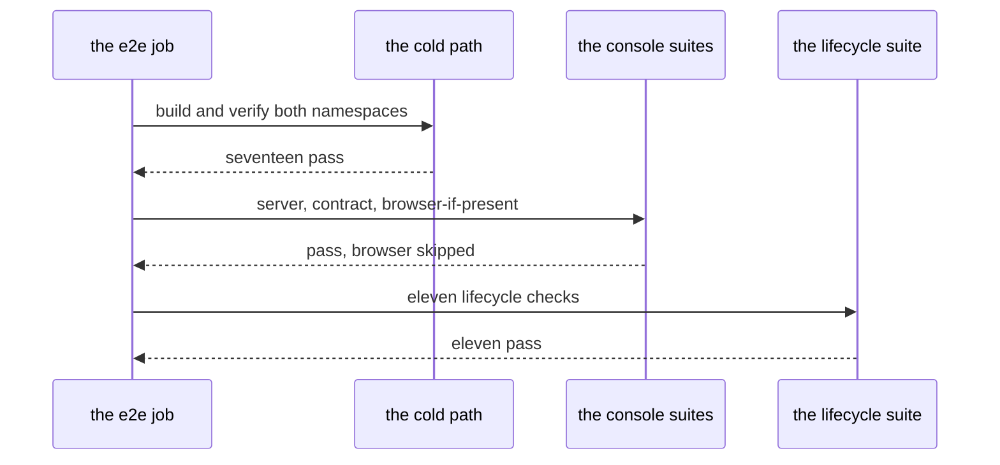

# CI05 - The e2e job runs the console and J suites

## In one sentence

After the cold path goes green, the same job also runs the console's server and contract suites and the eleven-check lifecycle suite, all inside a three-quarter-hour ceiling.

## How it works

## What changes

- **Two more steps on the same job** - after the cold path, the console suites run, then the lifecycle suite, reusing the stack the cold path just built.
- **A ceiling, not a measurement** - the job must finish inside three quarters of an hour; the number bounds cost, it does not describe speed.
- **Nothing else moves** - the fast job, the credentials, the build, the cold path and the failure evidence all stay exactly as they were.

## Choices you might want different

- The browser suite stays skipped on the runner, as it is for a human without the optional setup; wiring a browser into the pipeline is a larger change for another day.
