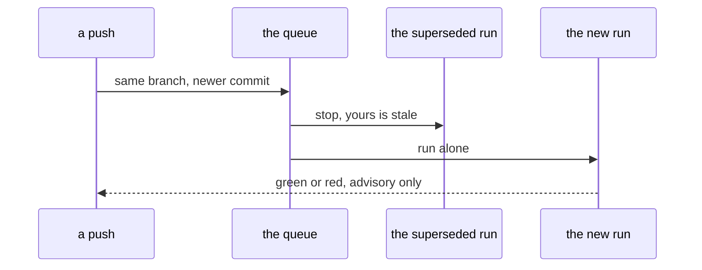

# CI06 - The pipeline is report-only, hardened and written down

## In one sentence

A newer push cancels the run it supersedes, a red run still blocks nothing, and the pipeline is described where the next reader looks.

## How it works

## What changes

- **One queue rule** - runs on the same branch cancel each other, so only the newest commit ever finishes.
- **Blocked nothing confirmed** - the main branch asks for no checks, so a red pipeline run is a signal, never a gate.
- **One row in the key-documents table** - pointing at the pipeline file and its design note.
- **One open question closed as deferred** - required checks wait until the long job is trusted, which is a decision, not a leftover.

## Choices you might want different

- Cancellation covers runs on the same branch only; a push to one branch never stops another branch's run.
